# Conversion Uplift & Experimentation Analytics

[](https://www.python.org/)
[](https://www.mysql.com/)
[](https://powerbi.microsoft.com/)
[](https://pixi.sh/)
[](https://pytest.org/)
[](https://pytask-dev.readthedocs.io/)
[](#license)

An end-to-end experimentation analytics project that measures the incremental impact of email campaigns on customer visits, conversions, and spend using **MySQL**, **Python**, **Power BI**, **Pixi**, **pytask**, and **pytest**.

This project is built around the **Kevin Hillstrom / MineThatData** email marketing dataset and focuses on a core business question:

> Did the campaign truly create incremental value, and which customer groups responded best?

---

## Executive Summary

This project combines **SQL analytics**, **Python data pipelines**, **baseline predictive modeling**, **uplift modeling**, and **Power BI reporting** into one reproducible experimentation workflow.

The analysis shows that email treatment generated positive incremental value overall, with **Mens E-Mail** emerging as the strongest campaign variant across visits, conversions, and spend per customer. The project goes beyond raw campaign reporting by explicitly comparing treatment against control and ranking customers by predicted and observed uplift.

---

## Business Problem

Marketing teams often know **who converts**, but not necessarily **who converts because of a campaign**.

This project focuses on **incremental impact** rather than raw performance:

- Did the email treatment outperform the control group?
- Which campaign variant performed best?
- Which customer segments responded more positively?
- Where should the business target future campaigns?

The analysis is designed to reflect a realistic experimentation workflow used in **growth**, **CRM**, **product analytics**, and **conversion optimization** settings.

---

## Project Goals

This project was built to:

- design a structured experimentation analytics workflow
- create a normalized analytical schema in MySQL
- automate ingestion, preprocessing, loading, testing, and export steps with Python and Pixi
- validate campaign performance with SQL
- measure uplift relative to control
- prepare reporting datasets for Power BI
- build baseline predictive models for visits, conversions, and spend
- build a first treatment-aware uplift modeling workflow
- create a portfolio-quality dashboard and GitHub-ready project package

---

## Tools & Technologies

- **MySQL** — normalized schema design, validation queries, experiment analysis, reporting views
- **Python** — ingestion, preprocessing, analysis, feature engineering, modeling, uplift scoring, export
- **Power BI** — dashboard design, KPI communication, drilldown reporting
- **Pixi** — environment and task management
- **pytask** — reproducible pipeline automation
- **pytest** — testing for ingestion, preprocessing, features, modeling, uplift, and export
- **VS Code** — main development environment
- **Git / GitHub** — version control and portfolio packaging

---

## Supporting Documentation

Additional project documentation is available in the `docs/` folder:

- `docs/main_project_steps.md` — project build tracker and development roadmap
- `docs/sql_analysis_summary.md` — written SQL findings and interpretation
- `docs/powerbi/dashboard_notes.md` — dashboard planning and storytelling notes
- `docs/powerbi/measures_kpis.md` — KPI definitions and Power BI metric logic

---

## Project Structure

```text
conversion_uplift_experimentation_project/
├── data/
│   ├── final/
│   │   ├── campaign_summary.csv
│   │   ├── channel_campaign_summary.csv
│   │   ├── customer_experiment_detail.csv
│   │   ├── history_segment_campaign_summary.csv
│   │   ├── modeling_base_dataset.csv
│   │   ├── modeling_features_encoded.csv
│   │   ├── modeling_target_conversion.csv
│   │   ├── modeling_target_spend.csv
│   │   ├── modeling_target_visit.csv
│   │   ├── newbie_campaign_summary.csv
│   │   ├── segment_uplift_summary.csv
│   │   ├── treatment_control_summary.csv
│   │   └── zip_campaign_summary.csv
│   ├── processed/
│   │   └── hillstrom_processed.csv
│   └── raw/
│       └── hillstrom.csv
│
├── docs/
│   ├── main_project_steps.md
│   ├── sql_analysis_summary.md
│   └── powerbi/
│       ├── dashboard_notes.md
│       └── measures_kpis.md
│
├── notebooks/
│
├── outputs/
│   ├── charts/
│   │   ├── average_spend_by_campaign_type.png
│   │   ├── campaign_outcome_bubble.png
│   │   ├── conversion_model_pr_auc_comparison.png
│   │   ├── conversion_rate_by_campaign_type.png
│   │   ├── history_segment_average_spend_ranked.png
│   │   ├── history_segment_conversion_rate_ranked.png
│   │   ├── observed_uplift_by_decile.png
│   │   ├── segment_outcome_heatmap_normalized.png
│   │   ├── spend_model_rmse_comparison.png
│   │   ├── treatment_control_average_spend_dumbbell.png
│   │   ├── treatment_control_conversion_rate_dumbbell.png
│   │   ├── treatment_control_visit_rate_dumbbell.png
│   │   ├── uplift_by_decile.png
│   │   ├── uplift_score_distribution.png
│   │   ├── visit_model_pr_auc_comparison.png
│   │   └── visit_rate_by_campaign_type.png
│   └── reports/
│       ├── powerbi/
│       │   ├── page_1_executive_overview.png
│       │   ├── page_2_experiment_performance.png
│       │   ├── page_3_customer_segment_insights.png
│       │   └── page_4_detailed_drilldown.png
│       ├── schema/
│       │   └── conversion_uplift_er_diagram.png
│       ├── feature_dataset_summary.csv
│       ├── modeling_classification_conversion_metrics.csv
│       ├── modeling_classification_visit_metrics.csv
│       ├── modeling_regression_spend_metrics.csv
│       ├── mysql_load_summary.csv
│       ├── python_campaign_type_summary.csv
│       ├── python_outcome_overview.csv
│       ├── python_segment_summary.csv
│       ├── python_treatment_control_summary.csv
│       ├── raw_data_ingestion_summary.csv
│       ├── reporting_export_summary.csv
│       ├── uplift_conversion_decile_summary.csv
│       ├── uplift_conversion_scored.csv
│       └── uplift_segment_summary.csv
│
├── powerbi/
│   ├── conversion_uplift_experimentation_dashboard.pbix
│
├── sql/
│   ├── 01_create_database.sql
│   ├── 02_create_tables.sql
│   ├── 03_load_raw_data.sql
│   ├── 04_validation_queries.sql
│   ├── 05_experiment_analysis_queries.sql
│   ├── 06_reporting_views.sql
│   └── 07_optional_advanced_queries.sql
│
├── src/
│   └── conversion_uplift/
│       ├── __init__.py
│       ├── analysis.py
│       ├── config.py
│       ├── database.py
│       ├── export.py
│       ├── features.py
│       ├── ingest.py
│       ├── load_mysql.py
│       ├── modeling.py
│       ├── preprocess.py
│       └── uplift.py
│
├── tasks/
│   ├── task_build_reporting_tables.py
│   ├── task_features.py
│   ├── task_ingest_data.py
│   ├── task_load_mysql.py
│   ├── task_model_scoring.py
│   ├── task_preprocess_data.py
│   └── task_uplift.py
│
├── tests/
│   ├── test_config.py
│   ├── test_database.py
│   ├── test_export.py
│   ├── test_features.py
│   ├── test_ingest.py
│   ├── test_modeling.py
│   ├── test_pipeline_integration.py
│   ├── test_preprocess.py
│   └── test_uplift.py
│
├── .env
├── .env.example
├── .gitignore
├── pixi.lock
├── pyproject.toml
└── README.md
```
---

## End-to-End Workflow

The project follows a realistic experimentation analytics workflow:

1. **Ingest raw data**
2. **Preprocess and enrich the dataset**
3. **Load processed data into MySQL**
4. **Validate schema and loaded records**
5. **Run SQL experiment analysis**
6. **Create reporting views**
7. **Export reporting datasets for Power BI**
8. **Analyze outcomes in Python**
9. **Prepare modeling features and targets**
10. **Build baseline predictive models**
11. **Build uplift models and validate observed uplift**
12. **Create stakeholder-facing dashboard pages**
13. **Document findings, pipeline, and project structure for GitHub**

---

## Dataset

This project uses the **Kevin Hillstrom / MineThatData** email marketing dataset.

The dataset includes customer-level fields such as:

- recency
- historical spend
- channel
- zip code group
- gender indicators
- newbie flag
- experimental segment assignment
- visit outcome
- conversion outcome
- spend outcome

The original experimental groups are transformed into an analytical structure suitable for experimentation reporting, predictive modeling, and uplift analysis.

---

## MySQL Data Model

A normalized 6-table schema was designed for the experiment workflow.

### Dimension tables
- `dim_zip_code`
- `dim_channel`
- `dim_campaign`
- `dim_customers`

### Fact tables
- `fact_campaign_assignment`
- `fact_campaign_outcomes`

This schema separates:
- customer attributes
- campaign assignment
- experimental outcomes

which makes validation, analysis, reporting, and export cleaner and more scalable.

---

## Entity Relationship Diagram

The project uses a normalized MySQL schema designed for experimentation analytics.  
The schema separates customer attributes, campaign assignment, and campaign outcomes into dimension and fact tables for cleaner validation, analysis, and reporting.

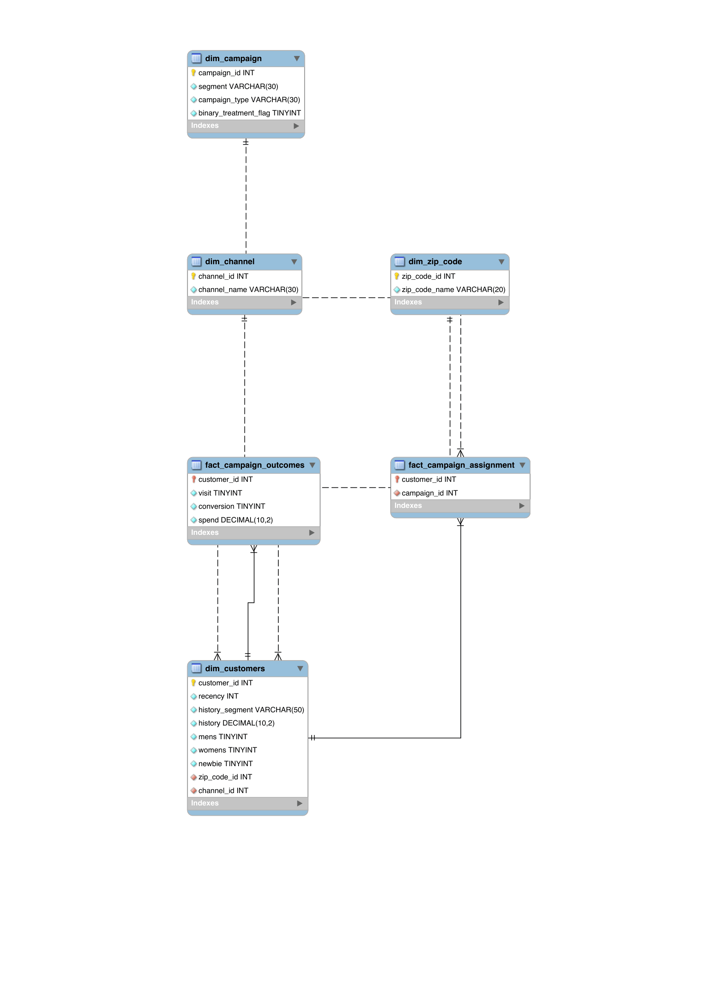

---

## SQL Layer

The SQL part of the project is split into clear stages.

### 1. Database and table creation
- `01_create_database.sql`
- `02_create_tables.sql`

### 2. Data loading
- `03_load_raw_data.sql`

### 3. Validation
- `04_validation_queries.sql`

Used to verify:
- row counts
- dimension integrity
- joins across schema
- campaign assignment distribution

### 4. Experiment analysis
- `05_experiment_analysis_queries.sql`

Used to evaluate:
- campaign-level visit rate
- conversion rate
- spend per customer
- spend per converter
- treatment vs control comparison
- uplift by campaign
- segmentation by channel, zip code, lifecycle, and customer history

### 5. Reporting views
- `06_reporting_views.sql`

Created reusable reporting views such as:
- customer experiment detail
- campaign summary
- treatment vs control summary
- segment uplift summary
- channel campaign summary
- zip campaign summary
- newbie campaign summary
- history segment campaign summary

### 6. Optional advanced SQL
- `07_optional_advanced_queries.sql`

Reserved for later portfolio extensions such as:
- ranking logic
- window functions
- deeper segment prioritization

---

## Python Pipeline

The Python side handles ingestion, preprocessing, analysis, feature engineering, modeling, uplift scoring, MySQL loading, and export.

### Main modules

#### `ingest.py`
Loads and validates the raw dataset.

#### `preprocess.py`
Builds the canonical processed dataset and creates fields needed for experiment analysis, including:

- `customer_id`
- `campaign_type`
- `binary_treatment_flag`

#### `analysis.py`
Performs business-oriented analysis of:
- visit
- conversion
- spend

It creates:
- treatment vs control comparisons
- campaign summaries
- segment summaries
- clean portfolio-ready charts

#### `features.py`
Builds modeling-ready datasets, including:
- modeling base dataset
- encoded feature matrix
- separate target files for visit, conversion, and spend

#### `modeling.py`
Builds baseline predictive models for:
- **conversion classification**
- **visit classification**
- **spend regression**

It compares multiple models and evaluates classification performance with **PR-AUC** and other metrics more appropriate for imbalanced targets.

#### `uplift.py`
Implements a first uplift modeling workflow using a **two-model approach**:
- one model for treated customers
- one model for control customers
- uplift score = predicted treated conversion probability − predicted control conversion probability

It also creates:
- customer-level uplift scores
- decile summaries
- observed uplift validation by decile
- segment-level uplift summaries

#### `load_mysql.py`
Loads processed data into the normalized MySQL schema.

#### `export.py`
Exports final reporting datasets for Power BI from MySQL reporting views.

#### `config.py`
Central configuration for paths and environment settings.

#### `database.py`
Database connection helpers.

---

## Reproducibility, Automation, and Testing

This project uses a workflow that is much closer to production-style analytics work than a one-off notebook analysis.

### Pixi
Used for environment management and reproducible task execution.

### pytask
Used to orchestrate reproducible pipeline steps such as:
- ingestion validation
- preprocessing
- feature preparation
- model scoring
- uplift workflow
- reporting export

### pytest
Used to test key logic layers across the project, including:
- configuration
- database helpers
- ingestion
- preprocessing
- feature engineering
- baseline modeling
- uplift logic
- export behavior
- lightweight pipeline integration

This makes the project more realistic, maintainable, and portfolio-ready.

---

## Running the Project

- Generated outputs are written to the project's structured data and output folders, including `data/processed/`, `data/final/`, `outputs/charts/`, and `outputs/reports/`.

### 1. Install the environment
```bash
pixi install
```
### 2. Run ingestion
```bash
pixi run ingest
```
### 3. Run preprocessing
```bash
pixi run preprocess
```
### 4. Run Python analysis
```bash
pixi run analyze
```
### 5. Build modeling features
```bash
pixi run features
```
### 6. Run baseline modeling
```bash
pixi run model
```
### 7. Run uplift modeling
```bash
pixi run uplift
```
### 8. Load data into MySQL
```bash
pixi run load-mysql
```
### 9. Export final reporting datasets
```bash
pixi run export
```
### 10. Run pytest
```bash
pixi run pytest
```
### 11. Run pytask pipeline
```bash
pixi run pytask
```

---

## SQL Analysis Highlights

A full written SQL summary is available here:

- `docs/sql_analysis_summary.md`

### Core findings from SQL

#### Campaign-level performance
- **Mens E-Mail** produced the strongest overall campaign performance
- **Womens E-Mail** also outperformed control
- **No E-Mail** served as the control baseline

#### Treatment vs control
Treatment outperformed control on:
- visit rate
- conversion rate
- average spend per customer

#### Segment-level differences
Performance varied across:
- channel
- zip code group
- customer lifecycle
- historical spend segments

This supports a more targeted campaign strategy rather than a uniform treatment approach.

---

## Python Analysis Highlights

The Python analysis layer complements the SQL work by creating business-oriented summaries and cleaner portfolio visuals.

### Core findings from Python analysis

- **Mens E-Mail** is consistently the strongest campaign variant
- **Womens E-Mail** outperforms control but remains below Mens E-Mail
- treatment outperforms control on:
  - visit rate
  - conversion rate
  - average spend
- higher customer history segments generally show stronger conversion and spend outcomes

### Selected Python visuals

#### Campaign Comparison Bubble Chart
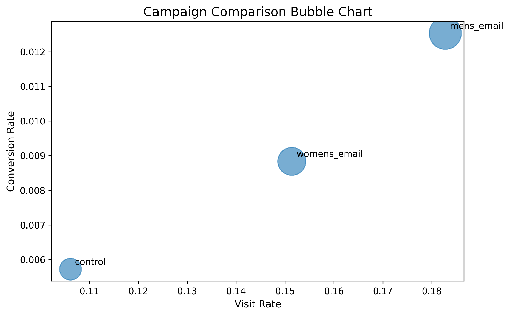

#### Segment Outcome Heatmap
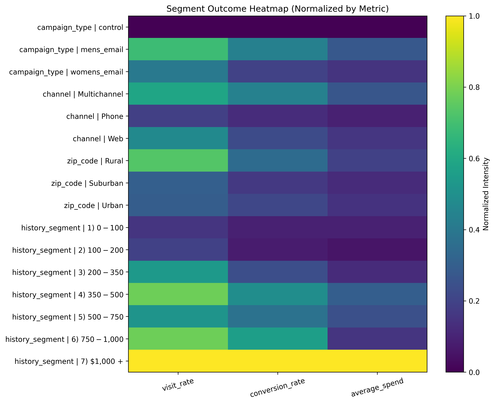

#### History Segment Ranking by Conversion Rate
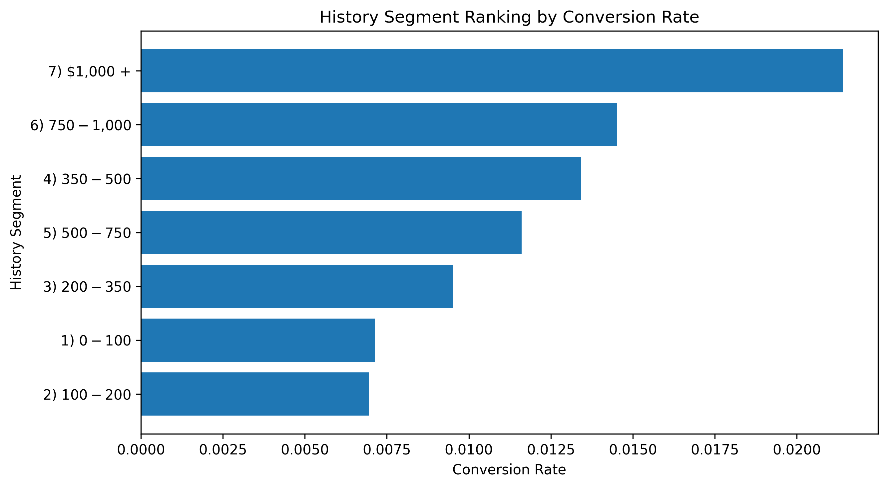

---

## Baseline Modeling Highlights

The project includes baseline predictive modeling for:
- **conversion** classification
- **visit** classification
- **spend** regression

### Modeling approach

#### Classification models
- Logistic Regression
- Decision Tree
- Random Forest

Classification evaluation emphasizes:
- PR-AUC
- ROC-AUC
- precision
- recall
- F1

rather than relying only on accuracy, because conversion is an imbalanced target.

#### Regression models
- Linear Regression
- Decision Tree Regressor
- Random Forest Regressor

### Main modeling findings

- **Logistic Regression** performed best for both:
  - conversion classification
  - visit classification
- **Linear Regression** produced the best baseline RMSE for spend
- conversion is substantially harder to model than visit
- visit contains more predictive signal than conversion

### Selected modeling visuals

#### Conversion Model PR-AUC Comparison
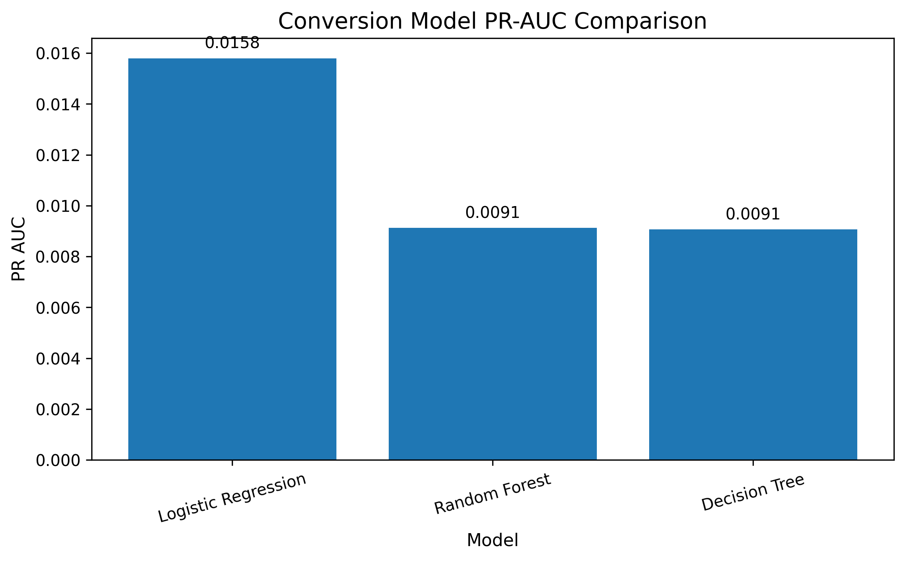

#### Visit Model PR-AUC Comparison
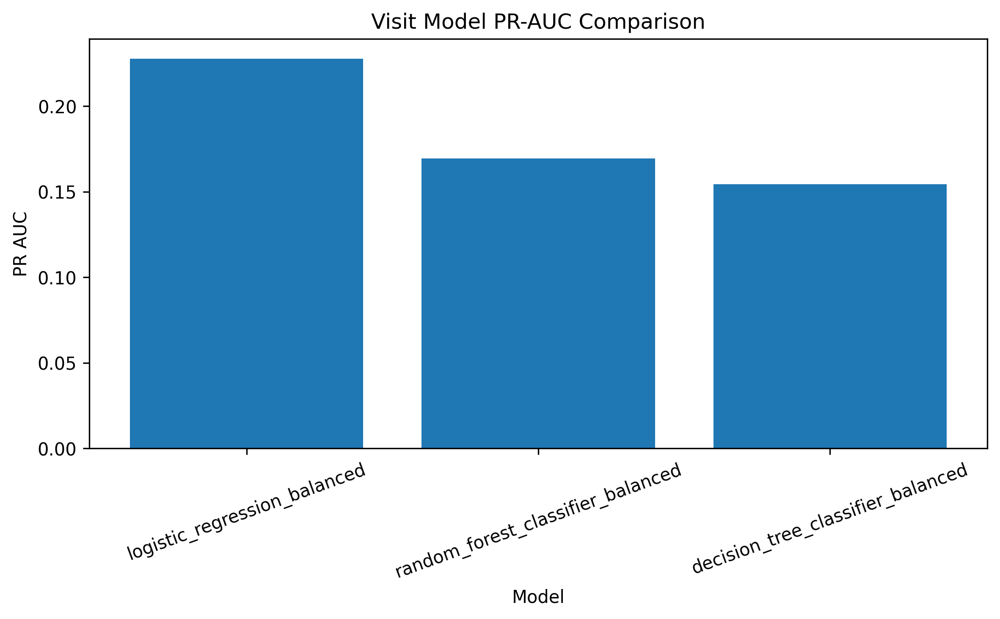

#### Spend Model RMSE Comparison
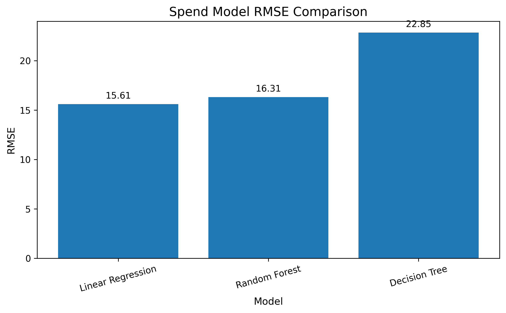

---

## Uplift Modeling Highlights

The project also includes a first treatment-aware modeling layer focused on **conversion uplift**.

### Uplift approach

A simple **two-model uplift approach** was used:

- model conversion probability for treated customers
- model conversion probability for control customers
- estimate customer-level uplift as the difference between those two predicted probabilities

This produces:
- uplift scores at the customer level
- uplift ranking by decile
- observed uplift validation by decile
- segment-level uplift summaries

### Main uplift findings

- the model identifies customers with both positive and negative predicted uplift
- top uplift deciles show positive observed uplift
- the bottom uplift decile shows negative observed uplift
- uplift is not uniform across segments, which supports more selective targeting

### Selected uplift visuals

#### Average Predicted Uplift by Decile
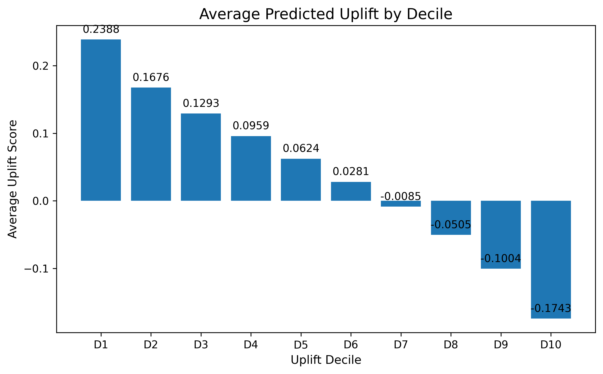

#### Observed Uplift by Decile
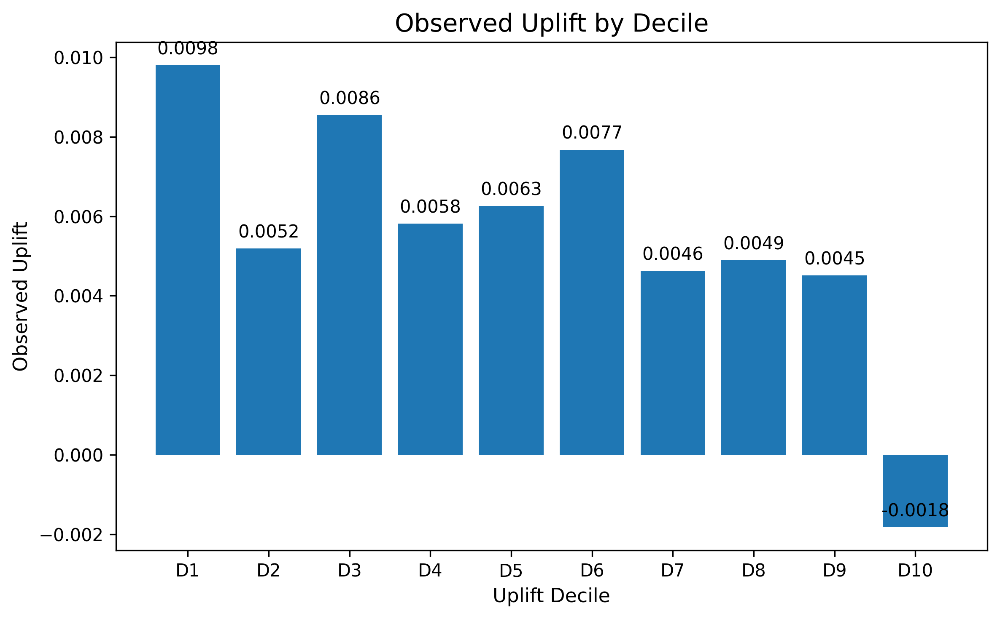

#### Uplift Score Distribution
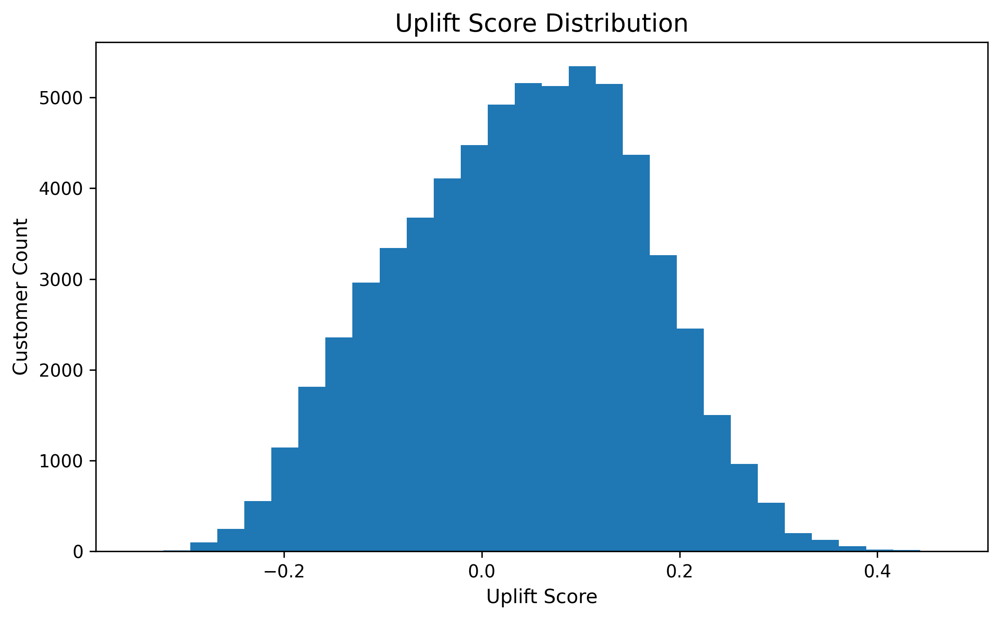

---

## Power BI Dashboard

The Power BI file is included here:

- `powerbi/conversion_uplift_experimentation_dashboard.pbix`

The dashboard is designed around 4 pages.

---

## Dashboard Page 1 — Executive Overview

Purpose:
- provide a top-level performance summary
- show headline KPIs
- communicate the main business result immediately

Includes:
- total customers
- visit rate
- conversion rate
- avg spend per customer
- campaign comparison charts
- treatment vs control conversion comparison
- executive takeaway

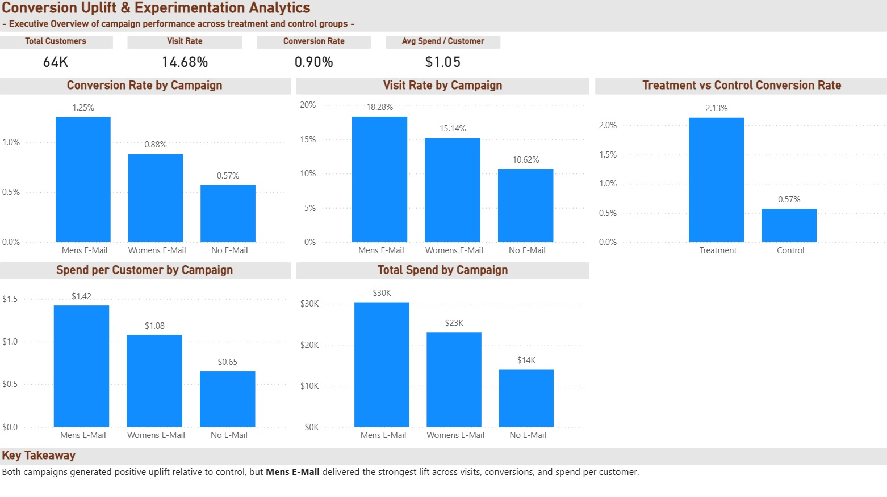

### Main takeaway
Email treatment outperformed control overall, and **Mens E-Mail** delivered the strongest aggregate campaign performance.

---

## Dashboard Page 2 — Experiment Performance

Purpose:
- focus on incremental impact
- compare treatment vs control directly
- show uplift by campaign

Includes:
- treatment and control KPI cards
- absolute visit uplift by campaign
- absolute conversion uplift by campaign
- absolute spend uplift by campaign
- treatment vs control spend comparison
- compact uplift summary table

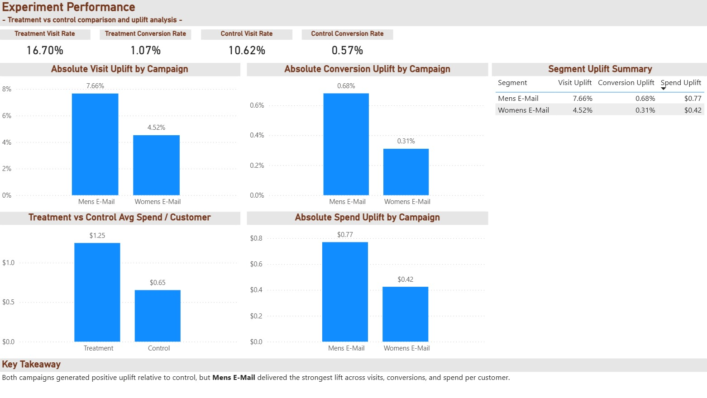

### Main takeaway
Both campaigns generated positive uplift relative to control, but **Mens E-Mail** produced the strongest lift across visits, conversions, and spend per customer.

---

## Dashboard Page 3 — Customer Segment Insights

Purpose:
- show that campaign performance varies across customer groups
- support targeting strategy

Includes:
- conversion rate by channel and campaign
- conversion rate by zip code group and campaign
- conversion rate by customer lifecycle and campaign
- conversion rate by history segment and campaign

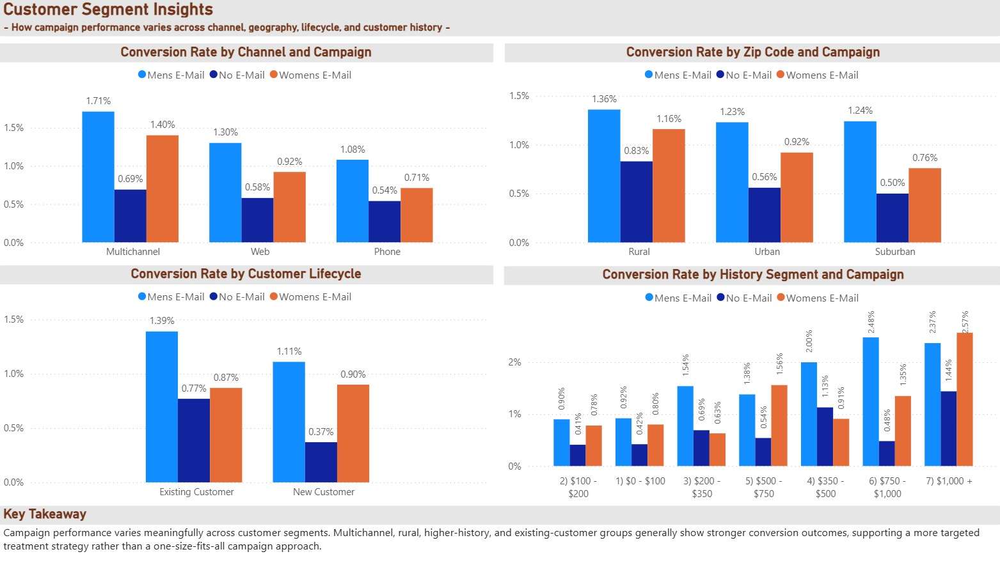

### Main takeaway
Campaign performance varies meaningfully across customer segments. Multichannel, rural, higher-history, and existing-customer groups generally show stronger conversion outcomes.

---

## Dashboard Page 4 — Detailed Drilldown

Purpose:
- allow customer-level filtering and exploration
- support drilldown and ad hoc investigation

Includes:
- slicers for campaign, treatment, channel, zip code, lifecycle, and history
- customer-level experiment table
- scatter plot of history vs post-campaign spend by segment

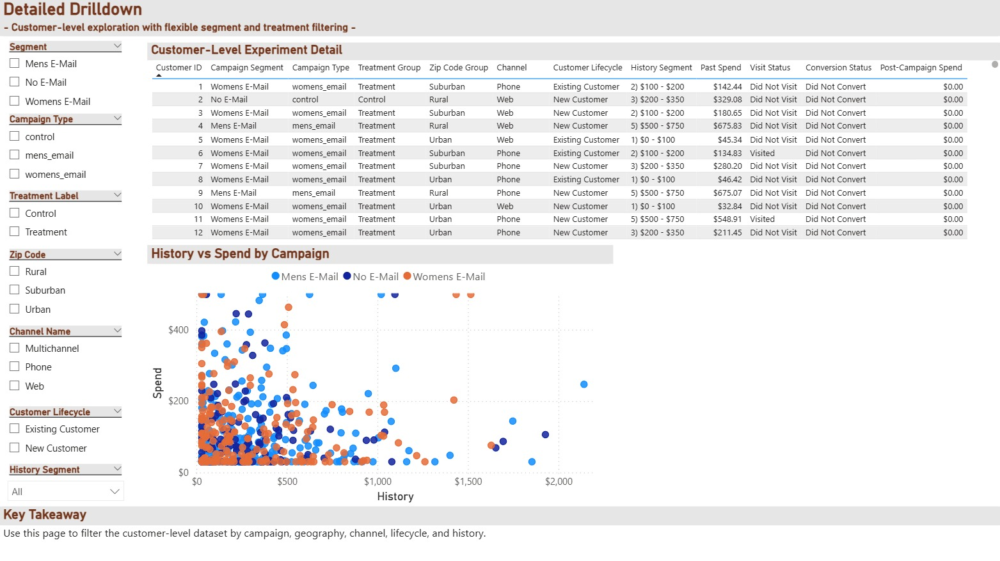

### Main takeaway
This page supports flexible customer-level exploration and makes the dashboard more useful for deeper analysis, not just summary reporting.

---

## Key Business Insights

### 1. Treatment created real incremental value
The treatment group outperformed control on visits, conversions, and spend per customer.

### 2. Mens E-Mail was the strongest campaign variant
Across SQL summaries, Python analysis, dashboard reporting, and uplift-oriented views, Mens E-Mail delivered the strongest performance.

### 3. Raw performance is not enough
The project emphasizes uplift and control comparison, which is more aligned with real experimentation and CRM targeting than raw conversion ranking alone.

### 4. Segment differences matter
Response differed by:
- channel
- geography
- lifecycle
- history band

This suggests that future campaigns should be more targeted.

### 5. Uplift is heterogeneous
Not all customers should be targeted equally. The uplift modeling layer shows both high-potential and low-potential groups.

---

## Why This Project Matters for My Portfolio

This project reflects the type of analytical workflow used in:

- product analytics
- experimentation analytics
- CRM analytics
- conversion optimization
- marketing measurement

It goes beyond a simple dashboard or notebook project by combining:

- normalized SQL schema design
- Python data pipeline work
- reproducible workflow tooling
- testing
- baseline modeling
- uplift modeling
- reporting views
- Power BI stakeholder communication

---

## Future Improvements

Possible next extensions include:

- compare multiple uplift modeling approaches
- add gain / Qini-style uplift evaluation
- expand optional advanced SQL ranking and prioritization queries
- improve spend modeling with alternative target transformations
- create a presentation-ready stakeholder slide deck
- extend dashboard with decision rules for campaign targeting

---

## How to Use This Repository

### SQL users
Inspect the database design, validation logic, experiment queries, and reporting views in the `sql/` folder.

### Python users
Reproduce preprocessing, feature engineering, modeling, uplift scoring, and export logic from the `src/conversion_uplift/` pipeline.

### BI users
Open the `.pbix` file and explore the four dashboard pages.

---

## Repository Assets

### SQL summary
- `docs/sql_analysis_summary.md`

### Power BI file
- `powerbi/conversion_uplift_experimentation_dashboard.pbix`

### Power BI summary files
- `docs/powerbi/dashboard_notes.md`
- `docs/powerbi/measures_kpis.md`

### Power BI screenshots
- `outputs/reports/powerbi/page_1_executive_overview.png`
- `outputs/reports/powerbi/page_2_experiment_performance.png`
- `outputs/reports/powerbi/page_3_customer_segment_insights.png`
- `outputs/reports/powerbi/page_4_detailed_drilldown.png`

### ER diagram
- `outputs/reports/schema/conversion_uplift_er_diagram.png`

---

## License

This project is licensed under the MIT License – see the `LICENSE` file for details.

---

## Contributing

Contributions are welcome. A sensible workflow is:

1. Fork the repository
2. Create a feature branch
3. Add or update tests
4. Submit a pull request

---

## Author

**Berke Pehlivan**  
Econometrics MSc — University of Bonn  
Data Analytics | SQL | Python | Power BI | Econometrics | Statistics

* [](https://github.com/Berke-Pehli)
* [](https://www.linkedin.com/in/berkepehlivan/)


This project is part of my portfolio work in analytics, experimentation, SQL, Python, and Power BI.

**Questions?** Open an issue on GitHub or contact the author directly.